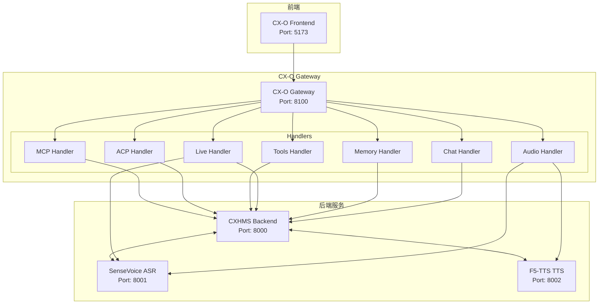
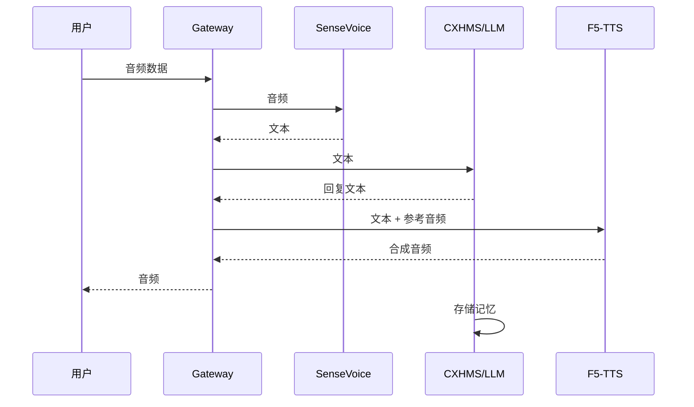
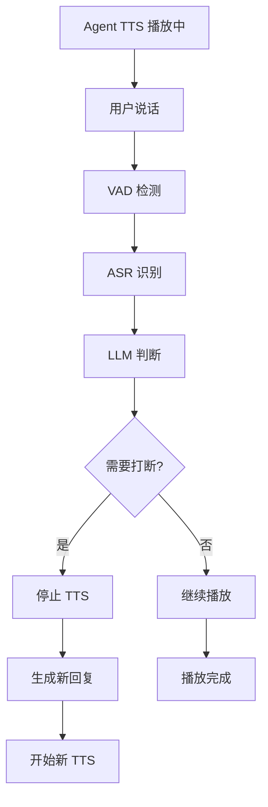
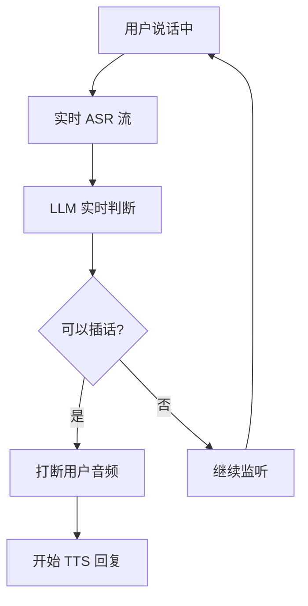
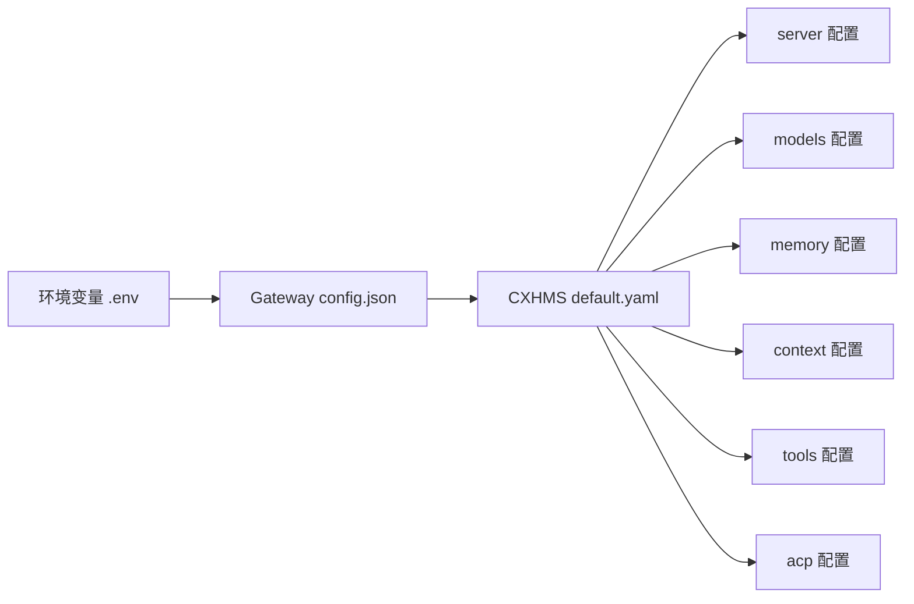

# CX-O 系统架构

## 整体架构图



## 模块职责

### CX-O Gateway（网关服务）

**职责**：作为统一入口，处理所有前端请求的路由和转发。

**核心组件**：
- **ConnectionManager**：WebSocket 连接管理
- **HealthChecker**：服务健康检查
- **Handler 模块**：处理不同类型的消息

**Handler 模块**：

| Handler | 职责 |
|---------|------|
| chat | 聊天消息处理，转发到 CXHMS |
| memory | 记忆 CRUD 操作 |
| audio | ASR/TTS 音频处理 |
| live | 直播客户端弹幕/VAD 处理 |
| tools | 工具调用 |
| acp | ACP 协议通信 |
| mcp | MCP 服务器管理 |
| plugin | 插件管理 |
| config | 配置管理 |
| metrics | 指标统计 |
| system | 系统操作 |

**Services 模块**：

| Service | 职责 |
|---------|------|
| CXHMSClient | 与 CXHMS 后端通信 |
| ASRClient | 语音识别客户端 |
| TTSClient | 语音合成客户端 |
| LiveClient | 直播客户端处理 |
| FirewallService | 弹幕防火墙 |
| VADProcessor | 语音活动检测 |
| ASRInterrupt | ASR 打断处理 |
| AgentInterruptUser | Agent 打断用户 |
| EmotionParser | 情感解析 |
| EffectParser | 音效解析 |
| PromptBuilder | 提示词构建 |
| HiddenPrompt | 隐藏提示词 |
| FrontendMarker | 前端标记 |
| MarkerAdapter | 标记适配器 |

### CXHMS Backend（核心后端）

**职责**：提供 Agent 系统、记忆管理、工具调用、上下文管理。

**核心组件**：

| 组件 | 职责 |
|------|------|
| MemoryManager | 记忆 CRUD、向量搜索、三维评分、衰减计算 |
| ContextManager | 会话管理、消息历史、上下文摘要 |
| ToolRegistry | 工具注册、发现、调用 |
| MCPManager | MCP 服务器生命周期管理 |
| ACPManager | Agent 发现、连接、群组、消息传递 |
| LLMClient | Ollama/VLLM 客户端封装 |
| ModelRouter | 多模型路由、故障转移 |

### SenseVoice（ASR 服务）

**职责**：语音识别，将音频转换为文本。

**端口**：8001

**特性**：
- 支持多语言
- 实时流式识别
- 情感识别（SER）

### F5-TTS（TTS 服务）

**职责**：零样本语音克隆合成。

**端口**：8002

**特性**：
- 参考音频 + 参考文本 → 克隆音色
- 支持情感 TTS（需 IndexTTS）
- 流式输出

## 数据流

### 语音对话流程



### 全双工打断流程

#### 场景 1：用户打断 Agent



#### 场景 2：Agent 打断用户



## 协议设计

### WebSocket 消息格式

**请求**：
```json
{
  "action": "module.action",
  "request_id": "uuid-string",
  "data": {}
}
```

**响应**：
```json
{
  "type": "response",
  "request_id": "uuid-string",
  "action": "module.action",
  "status": "success",
  "data": {}
}
```

### Action 命名空间

| 命名空间 | 描述 |
|---------|------|
| chat.* | 聊天相关操作 |
| memory.* | 记忆相关操作 |
| tools.* | 工具相关操作 |
| acp.* | ACP 协议操作 |
| mcp.* | MCP 协议操作 |
| asr.* | 语音识别操作 |
| tts.* | 语音合成操作 |
| config.* | 配置操作 |
| metrics.* | 指标操作 |
| system.* | 系统操作 |

## 存储架构

### SQLite（结构化数据）
- CXHMS 元数据
- 记忆内容
- 会话消息
- ACP 连接信息

### 向量存储（可选）
- **Milvus Lite**：轻量级向量数据库
- **ChromaDB**：本地向量库
- **Qdrant**：生产级向量服务

### 文件存储
- 音频参考文件：`data/voice_refs/`
- 备份文件：`data/backups/`

## 配置管理

### 配置层级



### 配置文件

| 文件 | 描述 |
|------|------|
| cx-o-gateway/config.json | 网关服务配置 |
| CXHMS/config/default.yaml | CXHMS 默认配置 |
| CXHMS/config/vad.yaml | VAD 语音检测配置 |
| CXHMS/config/firewall.yaml | 弹幕防火墙配置 |
| CXHMS/config/firewall_v3.yaml | v3 防火墙配置（打断） |
| CXHMS/config/hidden_prompt.yaml | 隐藏提示词 |
| CXHMS/config/danmaku.yaml | 弹幕配置 |

## 安全机制

### 弹幕防火墙（三档决策）

| 决策 | 行为 |
|------|------|
| BLOCK | 阻断弹幕，不加入上下文 |
| PASSIVE | 放行弹幕，加入上下文，不触发回复 |
| REPLY | 放行弹幕，加入上下文，触发 LLM 回复 |

### VAD 打断机制

**打断阈值配置**：
- `interrupt_threshold_ms`：打断阈值
- `min_speech_duration_ms`：最小语音时长
- `interrupt_cooldown_ms`：打断冷却时间

## 扩展性设计

### MCP 工具系统

支持通过 MCP（Model Context Protocol）扩展工具能力：
- 进程生命周期管理
- HTTP 端点通信
- 工具自动同步

### Agent 系统

- 多 Agent 支持
- Agent 克隆
- Agent 专属会话

### 模型路由

- 主模型（main）：通用对话
- 摘要模型（summary）：上下文摘要
- 记忆模型（memory）：记忆处理
