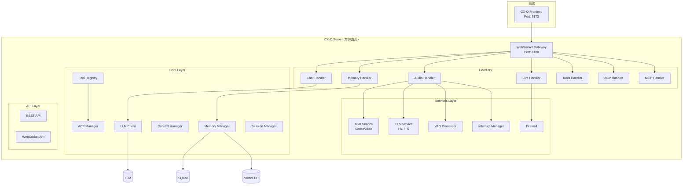
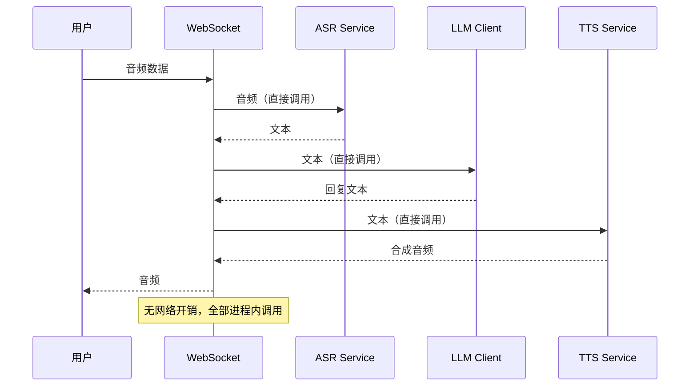
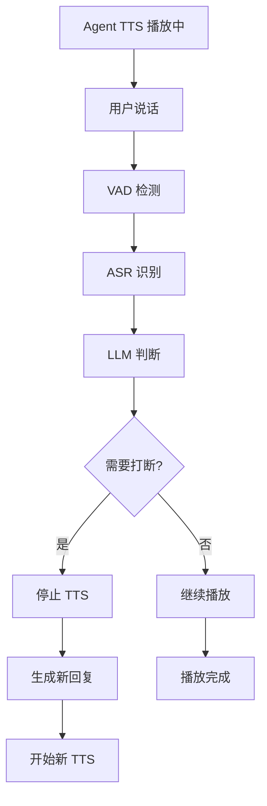
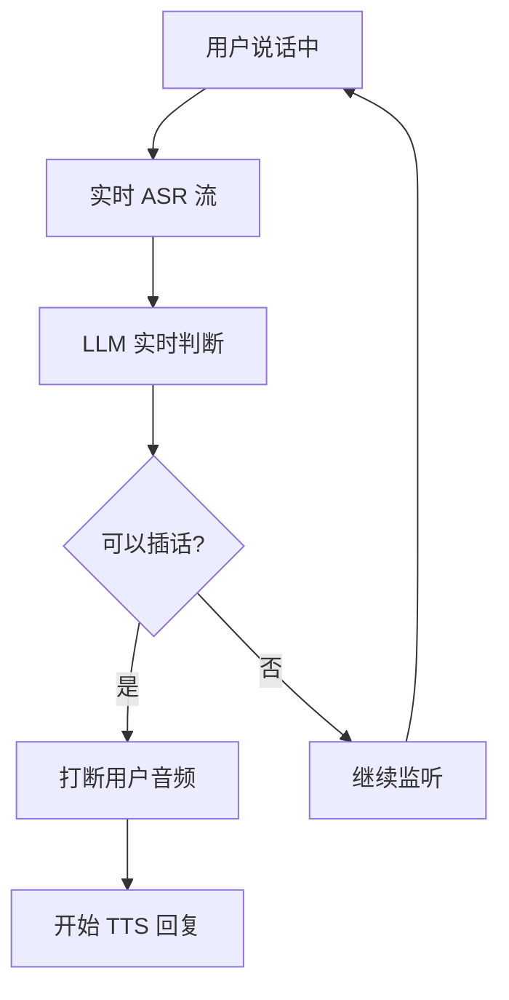

# CX-O 系统架构

## 整体架构图

### 单体架构（v4）



## 模块职责

### CX-O Server（单体应用）

**职责**：集成所有功能于单一应用中，降低延迟、简化部署。

**端口**：8100

**核心组件**：

| 层级 | 组件 | 职责 |
|------|------|------|
| Gateway | WebSocket Server | 前端通信、统一入口 |
| Handlers | Chat/Memory/Audio/Live | 消息处理路由 |
| Services | ASR/TTS/VAD | AI 服务直接调用 |
| Core | LLM/Memory/Tools/ACP | 核心业务逻辑 |
| API | REST/WebSocket | HTTP 接口 |

### 服务层级详情

#### Services Layer

| Service | 职责 | 备注 |
|---------|------|------|
| ASR Service | 语音识别（SenseVoice） | 直接调用模型，无 HTTP 开销 |
| TTS Service | 语音合成（F5-TTS） | 直接调用模型，无 HTTP 开销 |
| VAD Processor | 语音活动检测 | WebRTC/Energy/Silero |
| Firewall | 弹幕防火墙 | 三档决策 |
| Interrupt Manager | 打断管理 | 用户/Agent 相互打断 |
| Emotion Parser | 情感解析 | 支持情感 TTS |
| Effect Parser | 音效解析 | 音效插入 |

#### Core Layer

| 组件 | 职责 |
|------|------|
| LLM Client | Ollama/VLLM 客户端封装 |
| Memory Manager | 记忆 CRUD、向量搜索、衰减计算 |
| Context Manager | 会话管理、消息历史、上下文摘要 |
| Tool Registry | 工具注册、发现、调用 |
| ACP Manager | Agent 发现、连接、群组、消息传递 |
| Session Manager | 会话清理、元数据管理 |
| Alarm Manager | 定时提醒管理 |
| Backup Manager | 数据备份 |
| Plugin Manager | 插件生命周期管理 |
| WebSocket Manager | WebSocket 连接管理 |

## 数据流

### 语音对话流程（单体内部调用）



**对比微服务架构延迟**：

| 架构 | 阶段数 | 预估延迟 |
|------|--------|----------|
| 微服务 | Gateway → CXHMS → ASR/TTS (HTTP) | ~800ms |
| 单体 | 进程内直接调用 | ~400ms |

### 全双工打断流程

#### 场景 1：用户打断 Agent



#### 场景 2：Agent 打断用户



## 协议设计

### WebSocket 消息格式

**请求**：
```json
{
  "action": "module.action",
  "request_id": "uuid-string",
  "data": {}
}
```

**响应**：
```json
{
  "type": "response",
  "request_id": "uuid-string",
  "action": "module.action",
  "status": "success",
  "data": {}
}
```

### Action 命名空间

| 命名空间 | 描述 |
|---------|------|
| chat.* | 聊天相关操作 |
| memory.* | 记忆相关操作 |
| tools.* | 工具相关操作 |
| acp.* | ACP 协议操作 |
| mcp.* | MCP 协议操作 |
| asr.* | 语音识别操作 |
| tts.* | 语音合成操作 |
| config.* | 配置操作 |
| metrics.* | 指标操作 |
| system.* | 系统操作 |

## 存储架构

### SQLite（结构化数据）
- 记忆内容
- 会话消息
- ACP 连接信息

### 向量存储（可选）
- **Milvus Lite**：轻量级向量数据库
- **ChromaDB**：本地向量库
- **Qdrant**：生产级向量服务

### 文件存储
- 音频参考文件：`server/data/voice_refs/`
- 音效文件：`server/data/effects/`
- 备份文件：`data/backups/`

## 配置管理

### 统一配置

文件：`cx-o/server/config.json`

```json
{
  "server": {
    "host": "0.0.0.0",
    "port": 8100
  },
  "asr": {
    "model_dir": "SenseVoice",
    "device": "cuda",
    "enabled": true
  },
  "tts": {
    "model_dir": "F5-TTS",
    "device": "cuda",
    "enabled": true
  },
  "llm": {
    "provider": "ollama",
    "host": "http://localhost:11434",
    "model": "qwen3-vl:8b"
  }
}
```

## 目录结构

```
cx-o/
├── server/                    # 单体应用
│   ├── __init__.py
│   ├── main.py               # 入口文件
│   ├── config.py             # 配置管理
│   ├── config.json           # 配置文件
│   │
│   ├── gateway/              # WebSocket 网关
│   │   ├── server.py
│   │   ├── health.py
│   │   └── gateway_config.py
│   │
│   ├── handlers/             # 消息处理器
│   │   ├── chat.py
│   │   ├── memory.py
│   │   ├── audio.py
│   │   ├── live.py
│   │   ├── tools.py
│   │   ├── acp.py
│   │   ├── mcp.py
│   │   └── ...
│   │
│   ├── services/             # 服务层
│   │   ├── asr.py           # SenseVoice ASR
│   │   ├── tts.py           # F5-TTS TTS
│   │   ├── emotion.py
│   │   ├── effect.py
│   │   └── ...
│   │
│   ├── core/                # 核心业务层
│   │   ├── llm/
│   │   ├── memory/
│   │   ├── context/
│   │   ├── tools/
│   │   ├── acp/
│   │   └── ...
│   │
│   ├── api/                 # REST API
│   │   ├── app.py
│   │   ├── routers/
│   │   └── middleware/
│   │
│   ├── protocol/            # 协议定义
│   │   ├── message.py
│   │   └── actions.py
│   │
│   └── data/                 # 数据目录
│       ├── effects/
│       ├── acp/
│       └── voice_refs/
│
├── frontend/                # 前端（保持不变）
│   └── ...
│
└── data/                    # 共享数据
    ├── memories.db
    ├── sessions.db
    └── acp/
```

## 技术栈

- **框架**：Python 3.10+, FastAPI, uvicorn, WebSocket
- **AI 服务**：SenseVoice（ASR）、F5-TTS（TTS）
- **LLM**：Ollama、VLLM
- **数据库**：SQLite、Milvus Lite、ChromaDB
- **前端**：React 18+, TypeScript, Tailwind CSS, Zustand
- **协议**：MCP（Model Context Protocol）、ACP

## 扩展性设计

### MCP 工具系统

支持通过 MCP（Model Context Protocol）扩展工具能力。

### Agent 系统

- 多 Agent 支持
- Agent 克隆
- Agent 专属会话

### 模型路由

- 主模型（main）：通用对话
- 摘要模型（summary）：上下文摘要
- 记忆模型（memory）：记忆处理
