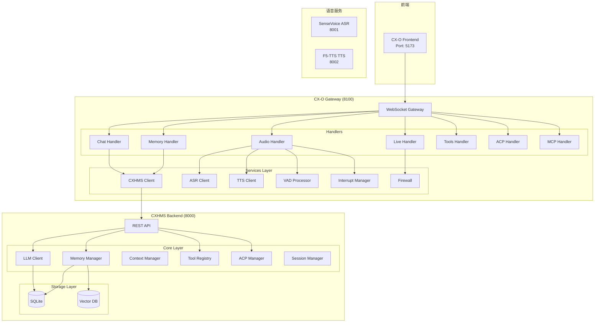
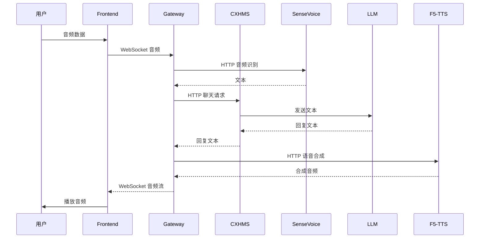
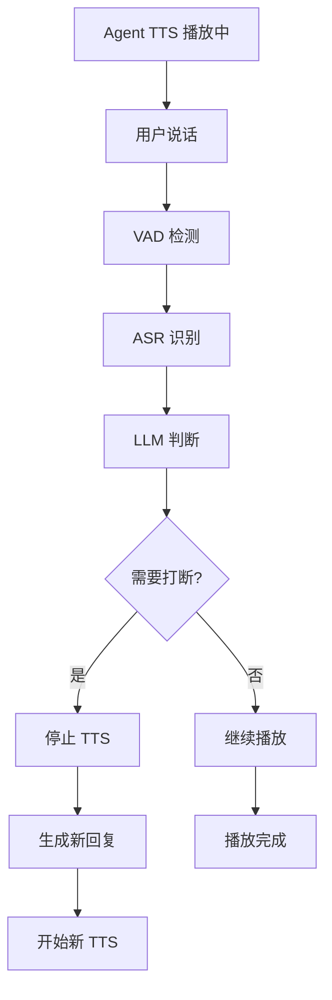
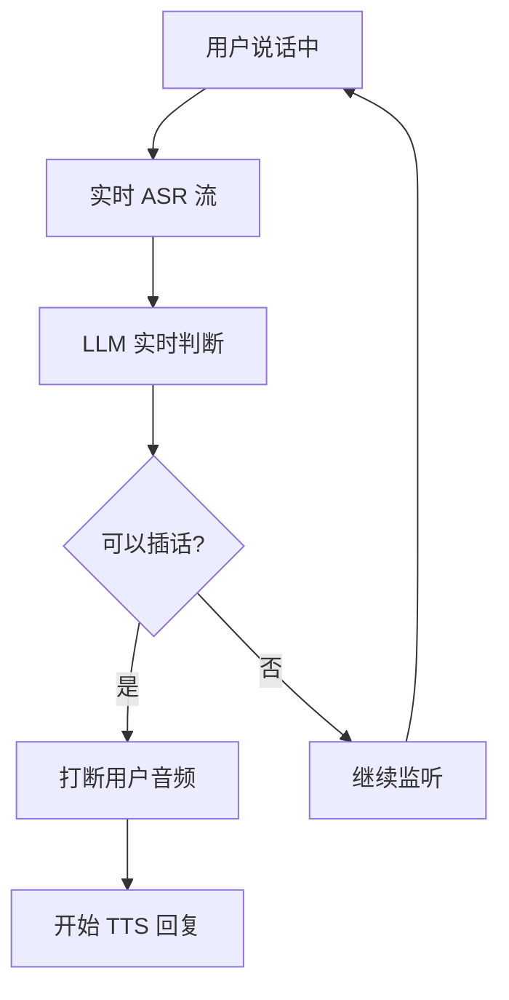

# CX-O 系统架构

## 整体架构图

CX-O 采用分布式微服务架构，由多个独立服务组成，各服务通过 HTTP/WebSocket 进行通信。



## 模块职责

### CX-O Gateway (端口 8100)

**职责**：统一入口，处理前端所有请求，协调各服务。

**核心组件**：

| 层级 | 组件 | 职责 |
|------|------|------|
| Gateway | WebSocket Server | 前端通信、统一入口 |
| Handlers | Chat/Memory/Audio/Live | 消息处理路由 |
| Services | CXHMS/TTS/ASR Clients | HTTP 客户端调用后端服务 |
| Services | VAD/Firewall/Interrupt | 音频处理和打断管理 |

### CXHMS Backend (端口 8000)

**职责**：核心 AI 服务，提供记忆管理、工具调用、ACP 协议等。

**核心组件**：

| 层级 | 组件 | 职责 |
|------|------|------|
| API | REST API | HTTP 接口 |
| Core | LLM Client | Ollama/VLLM 客户端封装 |
| Core | Memory Manager | 记忆 CRUD、向量搜索、衰减计算 |
| Core | Context Manager | 会话管理、消息历史、上下文摘要 |
| Core | Tool Registry | 工具注册、发现、调用 |
| Core | ACP Manager | Agent 发现、连接、群组、消息传递 |

## 数据流

### 语音对话流程



### 全双工打断流程

#### 场景 1：用户打断 Agent



#### 场景 2：Agent 打断用户



## 协议设计

### WebSocket 消息格式

**请求**：
```json
{
  "type": "request",
  "action": "module.action",
  "request_id": "uuid-string",
  "data": {}
}
```

**响应**：
```json
{
  "type": "response",
  "request_id": "uuid-string",
  "action": "module.action",
  "status": "success",
  "data": {}
}
```

### Action 命名空间

| 命名空间 | 描述 |
|---------|------|
| chat.* | 聊天相关操作 |
| memory.* | 记忆相关操作 |
| tools.* | 工具相关操作 |
| acp.* | ACP 协议操作 |
| mcp.* | MCP 协议操作 |
| asr.* | 语音识别操作 |
| tts.* | 语音合成操作 |
| config.* | 配置操作 |
| metrics.* | 指标操作 |
| system.* | 系统操作 |

## 存储架构

### SQLite（结构化数据）
- 记忆内容
- 会话消息
- ACP 连接信息

### 向量存储（可选）
- **Milvus Lite**：轻量级向量数据库
- **ChromaDB**：本地向量库
- **Qdrant**：生产级向量服务

### 文件存储
- 音频参考文件：`data/voice_refs/`
- 音效文件：`data/effects/`
- 备份文件：`data/backups/`

## 配置管理

### CXHMS 配置

文件：`CXHMS/config/default.yaml`

```yaml
server:
  host: "0.0.0.0"
  port: 8000

llm:
  provider: "ollama"
  host: "http://localhost:11434"
  model: "qwen3-vl:8b"

memory:
  enabled: true
  vector_enabled: true
  vector_backend: "milvus_lite"

acp:
  enabled: true
  agent_id: "cxhms_agent_001"
  discovery_enabled: true
```

### Gateway 配置

文件：`cx-o-gateway/config.json`

```json
{
  "server": {
    "host": "0.0.0.0",
    "port": 8100
  },
  "services": {
    "cxhms": {
      "url": "http://127.0.0.1:8000"
    },
    "sensevoice": {
      "url": "http://127.0.0.1:8001"
    },
    "f5tts": {
      "url": "http://127.0.0.1:8002"
    }
  }
}
```

## 目录结构

```
CX-O/
├── CXHMS/                    # CXHMS 后端服务
│   ├── backend/
│   │   ├── api/
│   │   │   ├── app.py        # FastAPI 应用
│   │   │   ├── routers/     # 路由模块
│   │   │   └── middleware/  # 中间件
│   │   ├── core/
│   │   │   ├── llm/         # LLM 客户端
│   │   │   ├── memory/      # 记忆系统
│   │   │   ├── context/     # 上下文管理
│   │   │   ├── tools/       # 工具系统
│   │   │   ├── acp/         # ACP 协议
│   │   │   └── ...
│   │   └── tests/
│   ├── config/
│   └── docs/
│
├── cx-o-gateway/             # 网关服务
│   ├── gateway/
│   │   ├── server.py
│   │   └── config.py
│   ├── handlers/             # 消息处理器
│   │   ├── chat.py
│   │   ├── audio.py
│   │   └── ...
│   ├── services/             # 服务客户端
│   │   ├── cxhms_client.py
│   │   ├── tts_client.py
│   │   ├── asr_client.py
│   │   └── ...
│   └── protocol/
│       ├── message.py
│       └── actions.py
│
├── cx-o-frontend/            # 前端界面
│   └── src/
│
├── SenseVoice/               # ASR 服务
├── F5-TTS/                  # TTS 服务
├── CosyVoice/               # 备用 TTS
├── F5-fast/                 # F5-TTS 推理优化
│
└── docs/                    # 文档
```

## 技术栈

- **框架**：Python 3.10+, FastAPI, uvicorn, WebSocket
- **AI 服务**：SenseVoice（ASR）、F5-TTS（TTS）
- **LLM**：Ollama、VLLM
- **数据库**：SQLite、Milvus Lite、ChromaDB
- **前端**：React 18+, TypeScript, Tailwind CSS, Zustand
- **协议**：MCP（Model Context Protocol）、ACP

## 扩展性设计

### MCP 工具系统

支持通过 MCP（Model Context Protocol）扩展工具能力。

### Agent 系统

- 多 Agent 支持
- Agent 克隆
- Agent 专属会话

### 模型路由

- 主模型（main）：通用对话
- 摘要模型（summary）：上下文摘要
- 记忆模型（memory）：记忆处理
